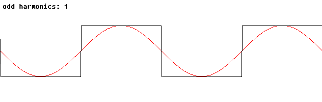
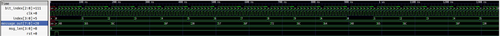

# EEMP Digital Design Lab

# Background
Everything around you uses signals like ..
In this lab, you will look at various signals 

## Signals
TODO: How to read digital signals

Square waves can be generated through various means such as natural crystals, analog circuit components, and even digital design itself. 

Source: https://commons.wikimedia.org/wiki/File:Sine_from_square_waves.gif

## Combinational Logic
Logic Gates

## Sequential Logic 
Clock Signal 

## 

## Simulation

# Instructions

## Surfer Waveform Viewer Overview
Waveform Viewer: https://app.surfer-project.org/

Walk through with pictures of common icons and buttons to know. 

# Lab 1
HelloWorld

# Lab 2
RISC Instruction Translation

# Lab 3
Traffic Lights 

# Lab 4 
Todo: 
Some Handshake Protocol?

# Lab 5
?? 

# (Optional:)

## Alternative Waveform Viewer: GTKWave
