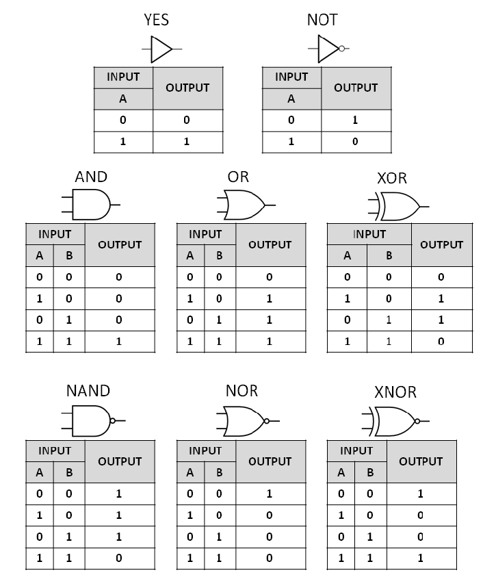

# EEMP Digital Design Lab

# Background
All the electronics around you can be decomposed to binary, ones and zeros. For example, the very device that you are using to look at this page is being translated to ones and zeros for your display to show. 

In this lab, you will look at various signals and get a feel of how looking at signals can allow you to get a "feel" about how computers work. 

Examples: 
- Controllers
- Logic (Algorithms)
- PWM Signals for controlling servos
- Communication
- Computer Architecture 

## Signals

(Figure x. Square Wave)

A **signal** is a square wave function that represents binary values of a high (1) and low value (0). Square waves have characteristics such as frequency and duty cycle. Frequency (Hz) is defined as how often the wave repeats itself per second. Duty cycle is the ratio between how long the signal stays high versus low. 
Square waves can be generated through various means such as natural crystals, analog circuit components, and even digital design itself. 

## Combinational Logic

Recall from the lecture about logic gates where AND, OR, NOT, XOR gates allow you to make calculations and decisions. 
Combinational Logic is a type of signal where the output only depends on the current input values. 

## Sequential Logic 

Sequential Logic is a type of signal where the output depends on both the current value and the sequence of past inputs. 
Sequential Logic allow signals to have memory about past decisions. One example is having a counter that counts upwards or downwards. 

## 

## Simulation
- Square Wave simulation showcase 

# Instructions

## Setup
- Download git - https://git-scm.com/downloads
    - If you are using windows, downloading from git-scm.com will give you a program called "Git Bash" 
    - If you are using mac, you can download via `brew install git` using homebrew and check that it has been installed 
    `git -v`
- Clone this repository
    - In git bash or your respective shell, execute this command: 
    `git clone https://github.com/Science-Mentorship-Institute/eemp_digital_design.git`
    - Alternatively: Download the files directly
        - Go to https://github.com/Science-Mentorship-Institute/eemp_digital_design.git
            - Press the Green "Code" Button and then click "Download ZIP"
            - Extract the ZIP to retrieve the files 

## Surfer Waveform Viewer Overview
Waveform Viewer: https://app.surfer-project.org/

Walk through with pictures of common icons and buttons to know. 

# Lab 0: Warmup
Drawing truth tables for combinational logic on a canvas quiz.

# Lab 1
Open `lab1_message_wave.vcd` file in a waveform viewer. 

# Lab 2
RISC Instruction Translation

Open `lab2_instruction_wave.vcd` file in a waveform viewer. 

# Lab 3
Traffic Lights 

Open `lab2_traffic_light_wave.vcd` file in a waveform viewer. 

# Lab 4 
UART Waveform

# Lab 5
?? 

# (Optional:)

## Generating the Waveforms
- Using RTL language and simulation 
[Click Here for more information about generating waveforms.](assets/Generating_Wave_Forms.md)

## Non-Ideal Conditions
A square wave is never just a square wave, in a real world, the square wave will slew due to many factors. 

[Click Here for more information about non ideal conditions](assets/Non_Ideal_Conditions.md)

## Alternative Waveform Viewer: GTKWave
- see: https://gtkwave.sourceforge.net