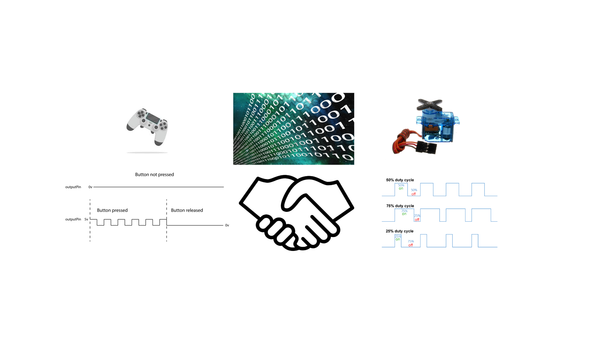
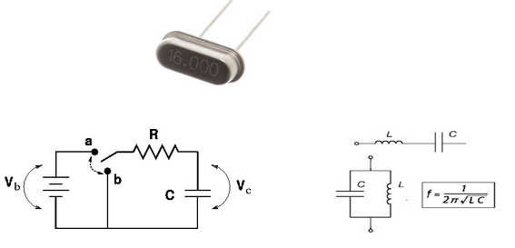
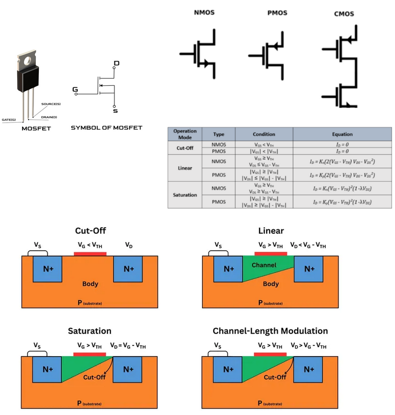
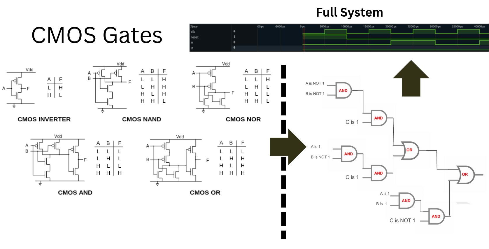
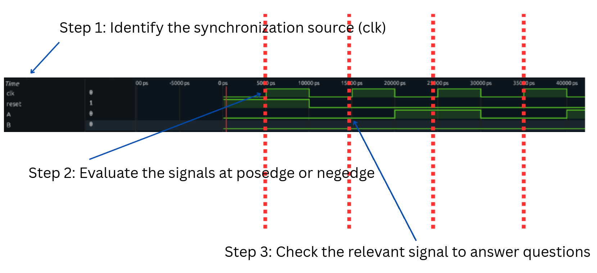

# EEMP Digital Design Lab

Welcome to the EEMP Digital Design Laboratory!

# Background
All electronics operate using binary—ones and zeros. For example, the device you're using translates data into binary for the display controller (e.g., HDMI) to render this page.

Examples: 
- Controllers
- Logic (Algorithms)
- PWM Signals for controlling servos
- Communication
- Computer Architecture 

In this lab, you'll explore different signals to get a better sense of how computers function and how complicated circuits are scaled.

## Where does Digital Design fit in?

**Clock Sources:**

To synchronize components in digital circuits and communication systems, a clock signal is used as a timing reference. This signal is typically generated by crystal oscillators or analog circuits such as RC or LC oscillators.

**Switches**

Switches enable basic logic, much like "if" statements in programming. In circuits, this role is often played by transistors—electronic switches with ON and OFF states. 
Without delving into the underlying physics, transistors have three operating modes, we can simplify them as OFF (cut-off/linear) and ON (saturation). Their state is controlled by changing voltages, allowing logical control.

**Combining it all together**

Using a clock source and transistor, you can start creating logic gates and combinational/sequential logic. Using both combinational and sequential logic, you can create any digital circuit including computer processing units and any other modern electronic applications.

## Signals

(Figure 1. Square Wave)

A **signal** is a square wave function that represents binary values of a high (1) and low value (0). Square waves have characteristics such as frequency and duty cycle. Frequency (Hz) is defined as how often the wave repeats itself per second. Knowing the frequency is important since it is used in sequential logic and determines how fast the digital design can run. 
**Duty cycle** is the ratio between how long the signal stays high versus low. Duty cycle is important in applications like turning a wheel and the duty cycle controls how fast or slow the wheel would move. 
**Square waves** can be generated through various means such as natural crystals and analog circuit components. 

## Combinational Logic

(Figure 2. Combinational Logic)

(Figure 3. Combinational Logic Truth Table)

Recall from the lecture about logic gates where AND, OR, NOT, XOR gates allow you to make calculations and decisions. 
Combinational Logic is a type of signal where the output only depends on the current input values. The figures above are the truth tables to common logic gates.

## Sequential Logic 

(Figure 4. Sequential Logic Diagram)
Sequential Logic is a type of signal where the output depends on both the current value and the sequence of past inputs. 
Sequential Logic allow signals to have memory about past decisions. One example is having a counter that counts upwards or downwards. 

## Binary<->Hexadecimal<->ASCII Conversion
In the context of digital design, binary is the most fundamental unit but often times converting to other units allow you to look at information more easily. 
Converting binary to hexadecimal allows you to reduce the number of visible digits there are. Then converting hexadecimal to ASCII is as easy as looking at the **two** hexadecimal values. The table below shows binary to its respective hexadecimal value. 

Binary to Hexadecimal Table:
| Binary | Hexadecimal | 
| ------ | ----------- |
| 0000   |      0      |
| 0001   |      1      |
| 0010   |      2      |
| 0011   |      3      |
| 0100   |      4      |
| 0101   |      5      |
| 0110   |      6      |
| 0111   |      7      |
| 1000   |      8      |
| 1001   |      9      |
| 1010   |      A      |
| 1011   |      B      |
| 1100   |      C      |
| 1101   |      D      |
| 1110   |      E      |
| 1111   |      F      |

(Ex. Convert 0b1100_1101_0011_0001 = 0xCD31) 
Tip: By splitting the bits into segments of 4 bits, converting it into hexadecimal is now just matching the 4 bits to its respective hexadecimal value. 

 

(Figure 5. ASCII Table)

## How to look at Waveforms

# Instructions

## Pre Lab
- Hosted Setup:
    - Make sure you can access https://app.surfer-project.org/
    - Check that you can load a waveform
        - Goto Surfer and Click on "File" on the top left and then click on "Open URL"
        - Enter `https://raw.githubusercontent.com/Science-Mentorship-Institute/eemp_digital_design/refs/heads/su25/lab1_message_wave.vcd` and press "Load URL" to load the waveform.
        - Make sure that under "Scopes", you can see "message_tb" 
        - Click on the dropdown for "message_tb" and make sure that under "Variables" that you can see the various signals such as "clk", "message_out", "msg_len", and "rst"
- Optional - Local Setup:
    - Download git - https://git-scm.com/downloads
        - If you are using windows, downloading from git-scm.com will give you a program called "Git Bash" 
        - If you are using mac, you can download via `brew install git` using homebrew and check that it has been installed 
        `git -v`
    - Clone this repository
        - In git bash or your respective shell, execute this command: 
        `git clone https://github.com/Science-Mentorship-Institute/eemp_digital_design.git`
        - Alternatively: Download the files directly
            - Go to https://github.com/Science-Mentorship-Institute/eemp_digital_design.git
                - Press the Green "Code" Button and then click "Download ZIP"
                - Extract the ZIP to retrieve the files 
        - Note: This is only required if loading files from URL doesn't work

## Surfer Waveform Viewer Overview
Surfer Waveform Viewer Online: https://app.surfer-project.org/
- Surfer can be installed locally. See: https://gitlab.com/surfer-project/surfer

The figure below shows the surfer user interface. 

- Note: You can load the waveforms from URL

# Lab 0: Warmup
Fill out the truth tables for several of these combinational logic questions.
| A | B | C | A AND B AND C | A AND B OR C | A AND B XOR C |
| - | - | - | ------------- | ----------- | ------------- |
| 0 | 0 | 0 | ?             | ?           | ?             |
| 0 | 0 | 1 | ?             | ?           | ?             |
| 0 | 1 | 0 | ?             | ?           | ?             |
| 0 | 1 | 1 | ?             | ?           | ?             |
| 1 | 0 | 0 | ?             | ?           | ?             |
| 1 | 0 | 1 | ?             | ?           | ?             |
| 1 | 1 | 0 | ?             | ?           | ?             |
| 1 | 1 | 1 | ?             | ?           | ?             |

# Lab 1: Message Translation 
Load the URL: `https://raw.githubusercontent.com/Science-Mentorship-Institute/eemp_digital_design/refs/heads/su25/lab1_message_wave.vcd` or Open `lab1_message_wave.vcd` file in a waveform viewer. 

Decode the message and write the message in ASCII Here: ____ 

# Lab 2: RISC_V Instruction Translation

**RISC-V Registers**

**RISC-V Types**

**RISC-V Instructions**
| Instruction       | Name          | Description                                   | Type      | Opcode    | Funct3    | Funct7    | Other     |
| --------          | -------       | --------                                      | -------   | --------  | -------   | -------   | -------   |
| add rd, rs1, rs2  | ADD      | rd = rs1 + rs2                                     | R         | 011 0011  | 000       | 000000    | -------   |
| addi rd, rs1, rs2 | ADD Immediate | R[rd] = R[rs1] + imm                          | I         | 001 0011  | 000       | -------   | -------   |
| li rd imm           | Load Immediate | R[rd] = imm                                | I         | 001 0011  | 000       | -------   | -------   |
| lb rd imm(rs1)    | Load Byte     | R[rd] = M[R[rs1] + imm][7:0] (Sign-extend)    | I         | 000 0011  | 000       |  -------  | -------   |
| sb rs2 imm(rs1)   | Store Byte    | M[R[rs1] + imm][15:0] = R[rs2][15:0]          | S         | 010 0011  | 010       | -------   | -------   |

Note: For a comprehensive list of RISC_V Instructions See: [List of RISC_V Instructions](assets/images/risc_v_instructions_specs.pdf).  

Load the URL: `https://raw.githubusercontent.com/Science-Mentorship-Institute/eemp_digital_design/refs/heads/su25/lab2_instruction_wave.vcd` or Open `lab2_instruction_wave.vcd` file in a waveform viewer. 

Decode the RISC_V Instruction by looking at the and write the instruction here:

1. 
2. 
3. 
4. 
5. 
6.
7.
8.
9.
10.
11.
12.
13. 
14. 
15.
16.

Optional: Can you translate or "guess" and write (pseudocode) this program? 

# Lab 3: Traffic Lights 

Load the URL: `https://raw.githubusercontent.com/Science-Mentorship-Institute/eemp_digital_design/refs/heads/su25/lab3_traffic_light_wave.vcd` or Open `lab2_traffic_light_wave.vcd` file in a waveform viewer. 

Figure out the sequence that the traffic lights is on and answer questions on various attributes of the traffic lights.
1. How much CLK cycles does the green light stay on for? 
2. How much CLK cycles does the orange light stay on for? 
3. How much CLK cycles does the red light stay on for? 
4. What is the initial state? 
5. What color stays on for the longest amount of time? 
6. Optional: Do the signals get evaluated during posedge or negedge? *hint: look at when the signals transition from HIGH/LOW*

# What is next?
- Learn how these signals are generated through hardware description language and simulation. 

# (Optional)

## Alternative Waveform Viewer: GTKWave
- see: https://gtkwave.sourceforge.net